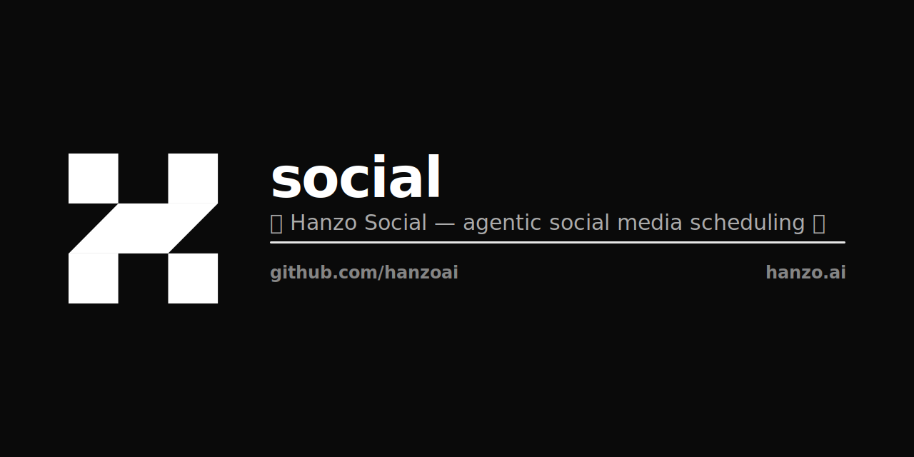

<p align="center"></p>

<p align="center">
  <a href="https://social.hanzo.ai" target="_blank">
    
  </a>
</p>

<p align="center">
  <a href="https://opensource.org/license/agpl-v3">
    
  </a>
</p>

<h2 align="center">Hanzo Social</h2>

<p align="center">
  Agentic social media scheduling for the Hanzo platform — schedule, publish, and analyze across 28+ channels.
</p>

<p align="center">
  <a href="https://social.hanzo.ai">social.hanzo.ai</a>
  ·
  <a href="https://hanzo.ai">hanzo.ai</a>
  ·
  <a href="https://hanzo.id">hanzo.id (SSO)</a>
</p>

---

## What this is

Hanzo Social is a hard fork of [`gitroomhq/postiz-app`](https://github.com/gitroomhq/postiz-app) (AGPL-3.0), rebranded and integrated with the Hanzo platform:

- **Auth** — Hanzo IAM (`hanzo.id`) via OIDC (`IAM_CLIENT_ID=hanzo-social`).
- **Storage** — Hanzo S3 (`s3-api.hanzo.ai`).
- **Secrets** — Hanzo KMS (`kms.hanzo.ai`) via `kms-fetch` init container.
- **Email** — `social@hanzo.ai` from the shared SMTP relay.
- **Bot** — `~/work/hanzo/bot` exposes `/social {schedule|draft|integrations}` against this backend.

Upstream remains the source of truth for the scheduling engine; brand and platform glue live in this repo.

## Develop

```bash
pnpm install
pnpm dev
```

See `CLAUDE.md` for repo layout and `apps/`, `libraries/` for the NestJS backend / Vite frontend / Temporal worker.

## License

AGPL-3.0 — same as upstream. See `LICENSE`.
